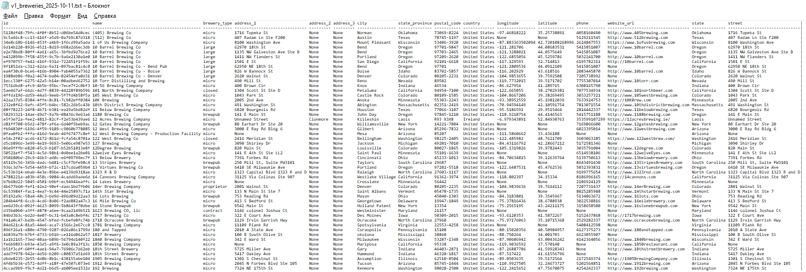

# ApiResponseRecorder
- ФИО: Иванов Тимофей Михайлович @Karo4a
- Группа: ИП-23-3
- Задание: Необходимо сделать выгрузку таблиц в файл, из вашей апи. Пишем программу на PYTHON, которая получает на вход урл вашей АПИ с данными, считывает данные, строит таблицу с заголовками (имена полей) и значениями, и сохраняет в файл с именем "имя_метода_апи.текущая_дата.txt"

## Установка зависимостей
```bash
$ pip install -r requirements.txt
```

## Пример работы
```bash
$ python main.py
Enter GET request api url:
> https://api.openbrewerydb.org/v1/breweries
Successfully recorded in output\v1_breweries_2025-10-11.txt
```
